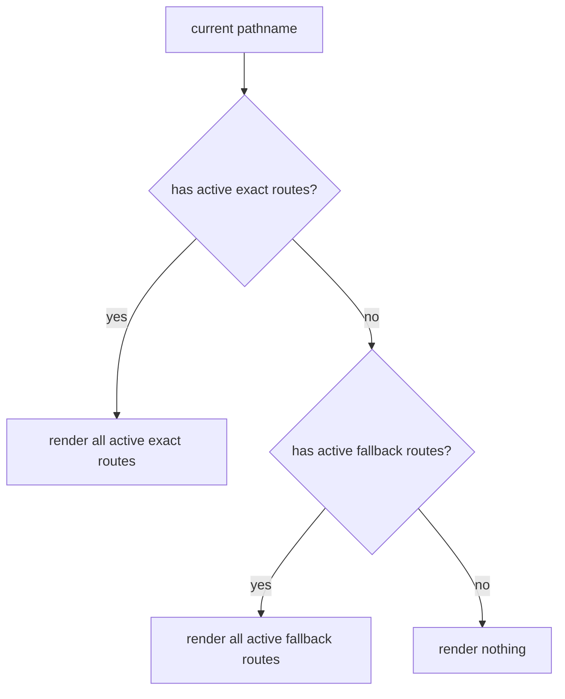
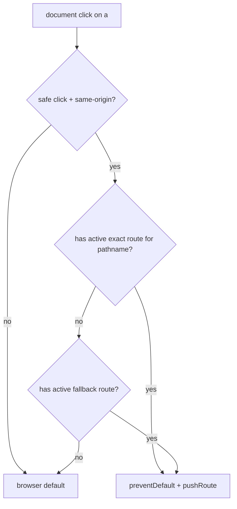

# Route Activation Design

**Date:** 2026-04-13

## Goal

在保留原生 `<a>` 路由体验的前提下, 把 route 激活规则收敛为一套统一运行时模型:

- `Route` 支持动态 `when`
- 同一路径允许多条非 fallback route 同时生效并全部渲染
- `path="/*"` 仅作为“当前无任何非 fallback route 命中”时的全局兜底
- `<a>` 点击仅在目标路径当前存在可生效 route 时才接管, 否则放行给浏览器

相关现状:

- 当前 `<a>` 拦截只校验同源与安全点击条件, 不校验目标 path 是否有 route 可接管, `src/route/navigation.ts:31`
- 当前 `Route` 只做单条精确比较, 不支持 `when`, 也不维护运行时 route registry, `src/route/Route.tsx:10`

## Scope

### In

- 为 `Route` 新增 `when?: boolean | (() => boolean)`
- 允许同一路径存在多条 active 非 fallback route, 命中时全部渲染
- 支持全局 fallback `path="/*"`
- fallback 仅在当前 `pathname` 没有任何 active 非 fallback route 时渲染
- `<a>` 点击只接管“目标路径当前存在 active 精确 route 或可用 fallback”的同源链接
- `when` 允许动态变化, 点击接管与渲染都按当前时刻实时求值

### Out

- 动态段, 例如 `/post/:id`
- 前缀通配, 例如 `/admin/*`
- 基于 query/hash 的 route 匹配
- SSR 路由能力
- `pushRoute()` / `replaceRoute()` 的可达性校验

## Public API

```tsx
<Route path="/dashboard" component={SummaryPage} />
<Route path="/dashboard" when={showExperiment} component={ExperimentPanel} />
<Route path="/admin" when={() => role() === "admin"} component={AdminPage} />
<Route path="/*" component={NotFoundPage} />
```

`when` 规则:

- 未传时等价于 `true`
- 可传布尔值或返回布尔值的函数
- 每次渲染匹配和点击接管都读取“当前值”, 不缓存旧命中结果

`path` 规则:

- 普通 path 继续保持静态精确匹配
- 仅支持 `/*` 这一种全局 fallback
- 不支持其他通配符写法

## Runtime Model

### Route registry

新增 detached 全局 registry, 只维护“当前已挂载 route 条目”。

建议 entry 结构:

```ts
type RegisteredRoute = {
  id: symbol;
  path: string;
  fallback: boolean;
  isEnabled: () => boolean;
};
```

约束:

- registry 不缓存命中结果, 只保存可实时求值的 route 条目
- registry 允许同一路径存在多条 entry
- registry 查询时每次都现读 `isEnabled()`

建议查询能力:

- `hasActiveExactRoute(pathname: string): boolean`
- `hasActiveFallbackRoute(): boolean`
- `matchesRoute(path: string, pathname: string): boolean`

### Route lifecycle

`Route` 初始化时注册 entry, 销毁时反注册。

`when` 更新时:

- 不重建 entry
- 由 `isEnabled()` 在当前时刻直接读取最新 `when`
- 因此 route 渲染和 `<a>` 点击接管都能即时反映动态 `when`

### Render rules

对当前 `pathname` 的渲染规则:

1. 先判断当前 route 自身 `when` 是否为真
2. 若是普通 path, 仅在 `path === pathname` 时渲染
3. 若是 `/*`, 仅在“当前没有任何 active 非 fallback route 命中”时渲染
4. 非 fallback route 之间不互斥, 命中的全部渲染
5. fallback route 只在兜底场景下渲染, 且允许多条 fallback 同时渲染



### Link interception

保留现有安全前置条件:

- 同源链接
- 左键点击
- 未被 `defaultPrevented`
- 无 `metaKey` / `ctrlKey` / `shiftKey` / `altKey`
- 无 `target`
- 无 `download`
- 非 hash-only 页面内跳转

在这些条件之后, 新增 route activation 校验:

1. 从 `href` 解析 `nextUrl.pathname`
2. 若 `hasActiveExactRoute(nextUrl.pathname)` 为真, 则接管
3. 否则若 `hasActiveFallbackRoute()` 为真, 也接管
4. 否则放行给浏览器默认导航

这里的“active”定义为:

- route 当前仍已挂载
- `when` 当前值为真

因此同一路径可能出现“这次点击能接管, 下次点击放行”的动态行为。



## Behavioral Examples

### Multiple active exact routes

```tsx
<Route path="/dashboard" component={SummaryPanel} />
<Route path="/dashboard" when={showExperiment} component={ExperimentPanel} />
```

若两者都 active:

- `/dashboard` 命中时两者都渲染
- `<a href="/dashboard">` 会被自动接管

### Fallback only when no exact route matches

```tsx
<Route path="/dashboard" component={DashboardPage} />
<Route path="/*" component={NotFoundPage} />
```

- 访问 `/dashboard` 时, 只渲染 `DashboardPage`
- 访问 `/unknown` 时, 渲染 `NotFoundPage`

### Dynamic when affects click interception

```tsx
<Route path="/admin" when={() => role() === "admin"} component={AdminPage} />
```

- 当前 `role() === "admin"` 时, 点击 `/admin` 会被接管
- 角色切换后 `when` 变为 `false`, 再次点击同一链接应直接放行

## Testing

单测至少覆盖:

- `when` 为 `true/false` 时 route 渲染与隐藏
- `when` 动态变化时渲染与点击接管同步变化
- 同路径多个 active 非 fallback route 会同时渲染
- 当前 path 有非 fallback 命中时 `/*` 不生效
- 当前 path 无非 fallback 命中时 `/*` 生效
- `<a>` 接管存在 active 精确 route 的 path
- `<a>` 在只有 fallback 可接住时也会接管
- `<a>` 不接管完全无 route 可生效的同源 path
- `pushRoute()` / `replaceRoute()` 仍可跳到任意 path, 不依赖 registry

## Risks

- [风险] `when` 若由频繁变化的 signal 驱动, registry 需要只保存 getter 而非快照, 否则会出现点击判定滞后
- [风险] `Route` 目前通过一次性 `untrack` 读取 `path` 与 `component`, 引入动态 `when` 后要明确只有 `when` 保持实时求值, `src/route/Route.tsx:10`
- [风险] fallback 参与点击接管, 需要用测试固定规则, 防止后续维护者又改回“只精确路由才能接管”

## Rollback

- 回退路径是删除 route registry、`when` 和 `/*` 逻辑, 恢复现有精确匹配与同源 `<a>` 接管模型
- `pushRoute()` / `replaceRoute()` 在本方案中保持不变, 回退风险主要集中在 `Route` 与 click interception
