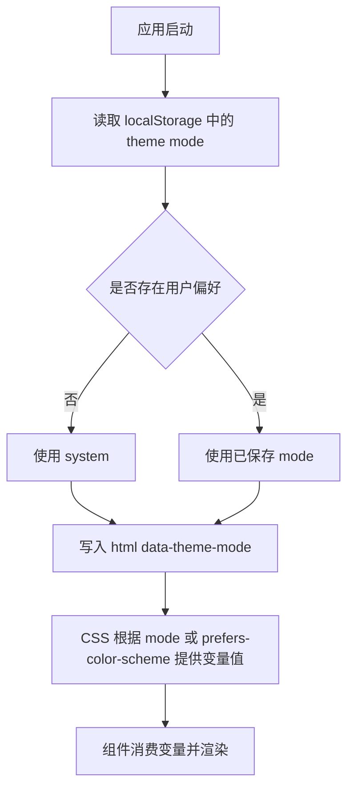

# UI Theme System Design

- 状态: `[新增]`
- 日期: `2026-04-14`

## 结论

本库的 UI 配色采用 `CSS 自治 + root 模式切换` 的最小主题模型:

- `html` 只负责 `data-theme-mode="system | light | dark"`
- 颜色值通过全局 CSS 变量提供
- 组件不判断亮暗模式, 只消费变量
- 默认组件无边框, 层级主要依赖 `base / raised / inset` 的表面差异与 `gap`
- `--theme-color` 和 `--error-color` 只做单色注入, 不再扩展为 `bg/fg/border` 三元组

## 目标

1. 默认跟随 `prefers-color-scheme`
2. 支持手动切换 `system | light | dark`
3. 本地记住用户模式偏好
4. 亮暗模式下沿用同一组变量名, 只替换值
5. 组件默认无边框, 不依赖组件专属 token 命名

## 变量模型

第一版公开变量固定为:

```css
--base-bg
--base-fg

--raised-bg
--raised-fg

--inset-bg
--inset-fg

--disabled-bg
--disabled-fg

--theme-color
--error-color
```

语义约定:

- `base`: 页面基准面与中性默认面
- `raised`: 浮起一层的表面, 适合 `card/panel`
- `inset`: 压入一层的表面, 适合 `input/embedded control`
- `disabled`: 禁用态专用表面与文字
- `theme-color`: 特殊主题色, 由组件决定如何消费
- `error-color`: 错误/校验信号色, 由组件决定如何消费

## 组件映射

第一版默认映射固定如下:

- `root/html`: 使用 `base`
- `card`: 使用 `raised`
- `input`: 使用 `inset`
- `button`: 默认使用 `base`
- `button.theme`: 使用 `--theme-color`
- `button.disabled` 或 `button:disabled`: 使用 `disabled`
- 表单报错/错误提示: 使用 `--error-color`

说明:

- `theme` 是附加语义, 不是完整色组
- `error-color` 是信号色, 第一版不扩展为 `error-bg/error-fg`
- `button.theme` 的前景色由组件内部自行决定, 暂不纳入公开变量契约

## 样式原则

1. 默认组件无边框
2. 同级关系优先用 `gap/spacing`
3. 父子层级优先用 `base / raised / inset` 的表面差异
4. 如确有需要, 可使用阴影或内阴影增强层级, 但不把 `border` 作为默认依赖
5. `theme-color` 只用于小面积强调, 不接管大面积背景

## 模式解析

模式只在 `root` 生效:

- `system`: 跟随 `prefers-color-scheme`
- `light`: 强制亮色
- `dark`: 强制暗色

启动与切换逻辑:



## CSS 结构

建议结构:

```css
html[data-theme-mode="light"] {
  --base-bg: ...;
  --base-fg: ...;
  --raised-bg: ...;
  --raised-fg: ...;
  --inset-bg: ...;
  --inset-fg: ...;
  --disabled-bg: ...;
  --disabled-fg: ...;
  --theme-color: ...;
  --error-color: ...;
}

html[data-theme-mode="dark"] {
  /* 同名变量, 另一套值 */
}

@media (prefers-color-scheme: dark) {
  html[data-theme-mode="system"] {
    /* system 模式下的暗色值 */
  }
}
```

组件示意:

```css
.card {
  background: var(--raised-bg);
  color: var(--raised-fg);
}

.input {
  background: var(--inset-bg);
  color: var(--inset-fg);
}

.button {
  background: var(--base-bg);
  color: var(--base-fg);
}

.button.theme {
  background: var(--theme-color);
}

.button.disabled,
.button:disabled {
  background: var(--disabled-bg);
  color: var(--disabled-fg);
}

.field-error {
  color: var(--error-color);
}
```

## 验收

1. 用户未手动设置时, 默认跟随 `prefers-color-scheme`
2. 用户手动切换后, 模式偏好被本地记忆
3. 亮暗模式只替换变量值, 不改变变量名
4. `card / input / button` 可直接通过固定变量组得到正确视觉层级
5. 默认组件无边框时, 仍可通过表面差异与间距形成足够层级
6. `theme-color` 与 `error-color` 作为单色注入即可覆盖首批强调和校验场景

## 风险

- `[风险]`: `button.theme` 没有公开的 `theme-fg`, 后续如果主题色范围扩大, 可能需要补充对比文字色策略
- `[缺口]`: 链接、focus ring、selected 状态尚未独立建模, 第一版默认可复用 `theme-color`
- `[缺口]`: 更复杂的嵌套表面未来可能需要在 `base/raised/inset` 之外继续扩层
- `[未涉]`: 尚未定义公开 JS API 命名与 localStorage key
- `[未涉]`: 尚未定义 `error-color` 在 destructive button 等更强场景中的扩展规则

## 参考

视觉验证基于预览页:

- [theme-preview-4.html](/._/solid-lib/.superpowers/brainstorm/654506-1776173710/theme-preview-4.html)
